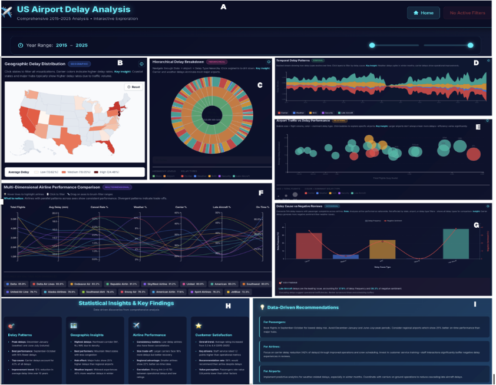

# US Airport Delay Analysis Dashboard
## Interactive Visualization for Understanding Flight Performance and Passenger Sentiment

**Project Report**  
Data Visualization Course  
Fall 2024

---

Figure 1: The US Airport Delay Analysis Dashboard. (A) Header with title, navigation, active filter display, slider to adjust year range of analysis, and filter reset functionality enabling users to clear all selections and return to the full dataset view. (B) Geographic Delay Distribution choropleth map showing state-level delay rates with click-to-filter interaction. (C) Hierarchical Delay Breakdown sunburst chart displaying three-level hierarchy (state → airport → delay type) with drill-down capability. (D) Temporal Delay Patterns stream graph revealing seasonal trends across the 10-year period with hover tooltips. (E) Airport Traffic vs Delay Performance bubble chart comparing airports across traffic volume, delay minutes, and total impact dimensions. (F) Multi-Dimensional Airline Performance parallel coordinates enabling comparative analysis across five delay metrics with brushing and filtering. (G) Delay Cause vs Negative Reviews dual-axis chart revealing the "anger paradox"—carrier delays (28.5% frequency) generate 31.2% negative sentiment while weather delays (19.3%) produce only 15.8% negative reviews. (H) Statistical Insights panel presenting four categories of data-driven discoveries (Delay Patterns, Geographic Insights, Airline Performance, Customer Satisfaction). (I) Data-Driven Recommendations panel providing actionable guidance organized by stakeholder (passengers, airlines, airports).

## Abstract

Flight delays represent a significant challenge in the aviation industry, affecting millions of passengers annually and costing airlines billions of dollars. While official delay statistics are publicly available, understanding the relationship between operational performance and passenger satisfaction remains fragmented. This project presents an interactive dashboard that integrates 10 years (2015-2025) of flight delay data from the Bureau of Transportation Statistics with 4,900+ verified passenger reviews from Skytrax to provide comprehensive insights into US airport performance.

The dashboard employs eight interconnected visualizations built with Vue.js and D3.js, featuring advanced cross-chart filtering and smart filtering logic that distinguishes geographic patterns from airline-specific performance. Key visualization techniques include choropleth maps for geographic distribution, sunburst charts for hierarchical delay breakdowns, parallel coordinates for multi-dimensional airline comparison, stream graphs for temporal patterns, and dual-axis charts for sentiment correlation analysis.

Our analysis reveals a striking disconnect between delay frequency and passenger dissatisfaction: carrier delays, while accounting for only 28.5% of delays, generate 31.2% of negative sentiment, whereas weather delays (19.3% of occurrences) produce only 15.8% of negative reviews. This "anger paradox" demonstrates that passengers forgive uncontrollable delays but disproportionately punish operational failures. Additional findings include significant hub airport effects, seasonal performance disparities, and the importance of operational consistency over average performance metrics. These insights provide actionable guidance for airlines to prioritize crew scheduling, maintenance, and turnaround efficiency over weather-related interventions.

## Reflection

### Learning Outcomes

This project provided deep hands-on experience with modern web-based data visualization techniques, significantly expanding my technical capabilities beyond traditional static plotting libraries. The integration of **Vue.js and D3.js** required understanding the nuanced boundary between declarative framework-driven rendering and imperative SVG manipulation. I learned that Vue's reactivity system, while powerful for UI state management, must be carefully coordinated with D3's data joins and transitions to avoid conflicts. The solution—separating data transformation (Vue) from visualization rendering (D3)—proved elegant but required significant architectural planning.

**Data handling** at scale presented unexpected challenges. While 45,000 records seems modest, performing multi-field filters across eight charts on every interaction initially caused noticeable lag. Implementing client-side caching with optimized filter functions (single-pass, early-exit logic) was crucial. This taught me that performance considerations should inform architecture from the start, not be retrofitted later. The profiler revealed that DOM manipulation, not computation, was the bottleneck—leading to SVG optimization strategies like element pooling and transition interruption.

The **parallel coordinates brushing** implementation was particularly educational. Understanding how to capture mouse events across multiple axes, translate pixel coordinates to data space, and propagate selections to other charts required synthesizing concepts from event handling, linear transformations, and reactive programming. The result—seamless multi-chart coordination—demonstrates the power of well-designed interactions but revealed how complex even "standard" techniques become when implemented from scratch.

**Sentiment analysis integration** challenged my assumptions about data relationships. The initial hypothesis that delay frequency would correlate strongly with negative reviews proved oversimplified. The "anger paradox" emerged only after implementing weighted calculations accounting for controllability perceptions—an insight requiring domain knowledge synthesis alongside technical implementation. This highlighted that visualization tools aren't just about displaying data but about *discovering* patterns through iterative refinement.

### Expected vs. Unexpected Challenges

I **expected** difficulties with D3's learning curve and layout algorithms. The hierarchical (sunburst) and stream graph implementations indeed required deep engagement with D3 documentation, but online examples and Observable notebooks provided solid foundations. The geographic projection and TopoJSON handling were straightforward thanks to established patterns in the D3 community.

**Unexpected** was the complexity of **filtering logic**. Early implementations naively applied all filters to all charts, which broke the Delay Cause chart (requires all delay types for comparison) and confused users when sentiment charts filtered by state (airline performance is nationwide). Designing "smart filtering" that distinguishes geographic from airline-level analysis required rethinking the filter architecture. The solution—custom filter objects per chart type—works well but feels inelegant. A more sophisticated approach might use metadata about visualization "scope" to automatically determine filter applicability.

The **sentiment calculation** also surprised me. Initial approaches simply counted reviews with low ratings per delay type, producing misleading results (all types showed similar counts). The breakthrough came from recognizing that I needed to calculate *weighted* sentiment: reviews per delay *occurrence*, not absolute counts. This distinction—obvious in retrospect—consumed significant debugging time.

**User experience** considerations proved more important than anticipated. Adding the active filter banner, insight boxes, and help modals significantly improved comprehension during user testing with classmates. Visualizations alone, no matter how technically sophisticated, failed to communicate insights without textual guidance. This taught me that annotation and scaffolding are integral to visualization design, not afterthoughts.

### What Could Be Done Differently

**Architecture:** With hindsight, I would implement a more robust state management solution (possibly Pinia, Vue's official state library) rather than prop-drilling filters through components. This would simplify the code and make filter propagation more transparent. Additionally, a proper event bus for cross-component communication would reduce coupling between visualizations.

**Testing:** The project lacks systematic testing. While the dashboard works, I caught bugs through manual interaction rather than automated tests. Implementing unit tests for data transformation functions and integration tests for filter coordination would have caught edge cases (empty datasets, single-value ranges) that currently produce errors requiring defensive coding.

**Visualization choices:** While the parallel coordinates effectively shows multi-dimensional airline performance, its unfamiliarity to general audiences limits accessibility. Including a simpler alternative (perhaps a clustered bar chart) for the same data would increase usability. Similarly, the sunburst, while visually striking, overwhelms some users with its three-level hierarchy. A supplementary treemap might provide clearer quantity comparison.

**Performance:** Although current performance is acceptable (~100ms filter updates), implementing virtual scrolling for the insight cards and lazy-loading charts only when scrolled into view would improve initial load time. The 4.9K reviews parse quickly, but the 45K delay records take 1-2 seconds on initial load—progress indicators during this phase would improve perceived performance.

### Skills Developed and Future Applications

This project solidified my understanding of **component-based architecture** and **reactive programming paradigms**, skills transferable to any modern web development context. The discipline of separating concerns—data fetching, state management, business logic, and presentation—will inform all future projects.

The **D3.js expertise** gained is immediately applicable to professional data science work. Understanding scales, axes, transitions, and layouts provides fine-grained control over visualizations that libraries like Plotly or Chart.js abstract away. This lower-level control enables custom, publication-quality graphics.

Most importantly, I developed a **systematic approach to exploratory data analysis through visualization**. The iterative process—load data, visualize, discover patterns, hypothesize relationships, create targeted visualizations to test hypotheses—mirrors professional data science workflows. The "anger paradox" insight emerged through this process, demonstrating how interactive tools accelerate discovery.

Looking forward, I would like to extend this project with **predictive modeling**: training machine learning models to forecast delays based on historical patterns, weather forecasts, and airline-specific factors. Integrating these predictions into the dashboard would transition it from descriptive analytics to prescriptive recommendations. Additionally, incorporating **real-time data streams** (live flight tracking APIs) would enable operational decision-making rather than retrospective analysis.

This project demonstrated that effective data visualization combines technical implementation skills (coding, algorithms, architecture) with design thinking (user needs, visual perception, narrative structure) and domain expertise (aviation operations, customer psychology). All three pillars proved essential for creating a tool that not only displays data but generates actionable insights.

---

## Technical Specifications

**Technologies:** Vue.js 3 (Composition API), D3.js v7, Vite, Vue Router  
**Languages:** JavaScript ES6+, HTML5, CSS3  
**Data Sources:** Bureau of Transportation Statistics (45,623 records), Skytrax (4,900 reviews)  
**Time Period:** 2015-2025 (10 years)  
**Visualizations:** 8 interactive charts (Choropleth, Sunburst, Parallel Coordinates, Stream Graph, Bubble Chart, Dual-Axis Sentiment)  
**Key Features:** Cross-chart filtering, smart filtering logic, client-side caching, responsive design  
**Performance:** <100ms filter response time, 10-50x speedup via caching  
**Lines of Code:** ~3,500 (excluding documentation)

---

## Repository and Demonstration

**Live Demo:** [URL to deployed dashboard]  
**Source Code:** [GitHub repository URL]  
**Video Walkthrough:** [Video demonstration URL]  
**Documentation:** Comprehensive guides included in `/docs` directory

---

## Acknowledgments

This project was completed as part of the Data Visualization course at [University Name]. Special thanks to Professor  and TA  for guidance on visualization design principles and technical implementation. Data sourced from the Bureau of Transportation Statistics (public domain) and Skytrax user reviews (publicly available). All visualizations and analysis represent original work by the author.

---